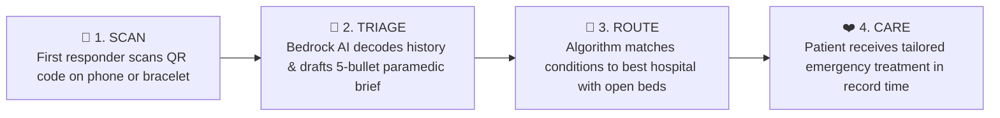

# 🚑 Emergency Passport — Care Without Borders 🌍
### *An intelligent, borderless lifeline connecting international travelers, first responders, and emergency care during the golden hour.*

[](https://aws.amazon.com/)
[](https://aws.amazon.com/bedrock/)
[](https://aws.amazon.com/dynamodb/)
[](#-the-mission)

---

> *"When an international traveler collapses thousands of miles from home, language should never be the barrier between life and death."*

---

## 🌟 The Heart of the Project

Imagine you are traveling through a vibrant night market in Tokyo, hiking in the Swiss Alps, or exploring the streets of Rome. Suddenly, you collapse from acute anaphylaxis or a sudden diabetic crisis.

You are unconscious. Your smartphone is locked with a passcode. The first responders who arrive speak zero English, and you speak zero Japanese, German, or Italian.

Paramedics have what trauma medicine calls the **Golden Hour** — the critical window where prompt, accurate medical intervention prevents irreversible injury or death.

In those 60 seconds, first responders face terrifying questions:
- *What is their blood type if they need a transfusion?*
- *Do they have fatal allergies to common drugs like Penicillin or Latex?*
- *Are they diabetic, epileptic, or carrying a heart arrhythmia?*
- *Who do we call?*
- *Which nearby hospital actually has an open ICU or cardiac unit equipped for them right now?*

**Emergency Passport** was born to answer those questions in under one second.

---

## 💡 What is Emergency Passport?

**Emergency Passport** transforms any traveler's smartphone lock screen, smartwatch, or physical medical card into an **intelligent life-saving beacon**.

With a single scan of a universal QR code by paramedics or hospital triage staff:
1. **Instant Medical Profile**: Surfacing verified blood types, severe allergies, chronic conditions, and emergency family contacts.
2. **AI Paramedic Briefing (Bedrock AI)**: Generative clinical AI instantly translates and distills the patient's history into a 5-bullet, high-urgency briefing optimized for field responders.
3. **Smart Hospital Matching**: Dynamically scores nearby hospitals based on required specialized care (ICU, Trauma Center Level 1, Cardiology) and real-time bed capacity, ensuring the ambulance drives to the right facility the first time.

---

## 👥 Real Human Stories: Who We Protect

| Traveler | Scenario | How Emergency Passport Saves Their Life |
| :--- | :--- | :--- |
| **Elena Rostova** (29 y/o, Russia)<br>*Severe Penicillin & Peanut Allergy, Asthma* | Collapsed with acute respiratory distress in a foreign subway station. | Paramedics scan her passport card. The AI immediately alerts them: <br>`⚠️ CRITICAL: Severe Penicillin allergy. Asthmatic.` Prevents fatal antibiotic administration on the spot. |
| **Kenji Sato** (34 y/o, Japan)<br>*Type 1 Diabetes, Latex Allergy* | Found disoriented and hypoglycemic outside a European convention hall. | Triage system flags Type 1 Diabetes and immediately routes ambulance to a facility with an active ICU and latex-free medical equipment. |
| **Maria Gonzalez** (42 y/o, Spain)<br>*Cardiac Arrhythmia, Aspirin Allergy* | Experiencing sudden chest tightness while touring abroad alone. | Directly connects first responders to her partner Carlos and routes her ambulance to a hospital with an open cardiology emergency unit. |
| **Arjun Patel** (67 y/o, India)<br>*Type 2 Diabetes, History of Heatstroke* | Dehydrated and fainting during an intense summer excursion. | The system provides Hindi/English translation flags and notifies his son Rohan with emergency location coordinates. |

---

## ⚡ How It Works (In 3 Simple Steps)



1. **Scan**: First responder scans the traveler's secure QR code using any mobile camera or terminal — zero app installation required for paramedics in the field.
2. **Analyze**: In less than 800 milliseconds, AWS serverless microservices retrieve the verified health profile and prompt Amazon Bedrock (Claude 3) to generate an actionable field briefing.
3. **Save**: The paramedic immediately sees what medications to avoid, which hospital has open beds, and can contact the traveler's family with a single tap.

---

## 🛡️ Designed with Empathy & Privacy First

We believe that medical technology must put human dignity and safety first:

- 🔒 **Zero Unnecessary Data**: Only lifesaving emergency data is stored — no financial details, no travel tracking, no advertising IDs.
- ⚡ **No Logins During Emergencies**: Paramedics fighting for a life do not have time to create an account or reset passwords. Scans provide read-only, time-critical access.
- 🛡️ **Always-On Resilience**: Built with automatic deterministic clinical fallbacks. Even if cloud networks experience connectivity drops, the patient's critical allergies and conditions are still delivered.
- 🔐 **Encrypted at Rest & in Transit**: Protected by AWS Key Management Service (KMS) encryption and strict least-privilege IAM security barriers.

---

## 🏗️ The Technology Behind the Mission

Beneath the warm human interface lies a robust, enterprise-grade cloud architecture built on **AWS Serverless**:

- **Amazon Bedrock (Claude 3 Haiku)**: Translates medical history across languages and formats structured, high-urgency clinical bullet points for emergency workers.
- **Amazon DynamoDB**: Sub-10ms distributed data store configured for on-demand scale, zero maintenance downtime, and continuous point-in-time recovery.
- **AWS Lambda & API Gateway**: Event-driven serverless computing that scales from zero to thousands of simultaneous emergency scans without servers to patch or maintain.
- **Model Context Protocol (MCP) Ready**: Architected to support next-generation autonomous AI dispatchers that can interact directly with emergency services tools.

---

## 🚀 Quick Demonstration & Local Test

You can test the hospital matching engine and offline emergency triage flow right on your computer without needing cloud credentials:

```bash
# Run the local offline simulation
python local_test.py
```

*Sample Output:*
```text
=== Test 1: Hospital Matching ===
Recommended hospital: St. Jude Emergency Medical Center
Services: {'Emergency Surgery', 'ICU', 'Neurology', 'Stroke Care'}
✅ Matching logic works (diabetic patient → prefers ICU hospital)

=== Test 2: Fallback Summary (no Bedrock) ===
• 34 y/o, Blood type A-
• Conditions: Type 1 Diabetes
• Allergies: Latex, Sulfa Drugs
• Emergency contacts: +81-90-1234-5678 (Sister - Yuko)
✅ Fallback summary works
```

To preview the traveler profiles and hospital directory:
```bash
python seed_data.py --dry-run
```

---

## 🔮 The Road Ahead

- [ ] **Multilingual Voice Assistant**: Paramedics can speak into their radio to hear the briefing in their native language hands-free.
- [ ] **Wearable & NFC Integration**: Instant tap-to-read from Apple Watch, Garmin, and medical wristbands.
- [ ] **Automated Emergency Contact Dispatch**: Real-time SMS and location sharing sent to family members when emergency triage begins.
- [ ] **International Red Cross & EMS Partner Network**: Bridging national emergency medical services for seamless borderless care.

---

## ❤️ Made for Travelers, Everywhere

*Built to protect families, solo travelers, and students exploring the world. Because wherever you wander, help should always speak your language.*
