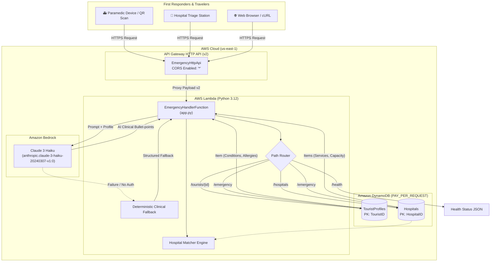
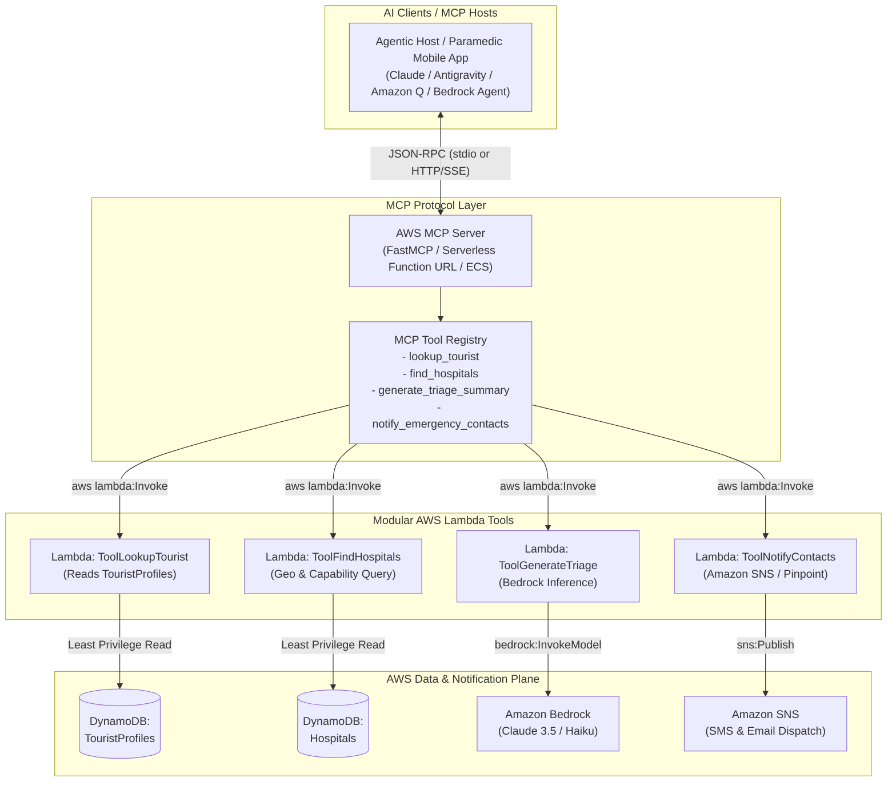

# Emergency Passport System 🚑🌍
### *Serverless Medical Profile Retrieval & Agentic Triage Platform*

[](https://aws.amazon.com/serverless/sam/)
[](https://www.python.org/)
[](https://aws.amazon.com/bedrock/)
[](https://aws.amazon.com/dynamodb/)
[](https://modelcontextprotocol.io/)

---

## 📖 Executive Summary

The **Emergency Passport System** is an emergency medical response platform built on AWS serverless architecture. It enables first responders, paramedics, and hospital triage teams to instantly access critical traveler health data (allergies, pre-existing conditions, blood type, languages spoken, emergency contacts) by scanning a QR code or querying an identifier (`TouristID`).

The system integrates **Amazon Bedrock (Claude 3 Haiku)** to generate bulleted, paramedic-optimized clinical triage summaries within seconds and executes a capability-aware matching algorithm that identifies the most appropriate medical facility based on required trauma levels, specialized departments (ICU, Cardiology, Trauma Level 1), and live bed capacity.

---

## 📋 Table of Contents
1. [What Has Been Done Till Now](#-what-has-been-done-till-now)
2. [Current Architecture & Code Overview](#-current-architecture--code-overview)
3. [Deep Dive into Implemented Code Modules](#-deep-dive-into-implemented-code-modules)
4. [Modern Serverless Architecture with AWS MCP & Lambda Tools](#-modern-serverless-architecture-with-aws-mcp--lambda-tools)
   - [What is MCP & Why Use It Here?](#what-is-mcp--why-use-it-here)
   - [Target Agentic Serverless Blueprint](#target-agentic-serverless-blueprint)
   - [Recommended Directory Re-Structuring](#recommended-directory-re-structuring)
   - [Implementing Modular Lambda Tools & MCP Server](#implementing-modular-lambda-tools--mcp-server)
   - [Step-by-Step Implementation Guide for AWS MCP & Lambda Tools](#-step-by-step-implementation-guide-for-aws-mcp--lambda-tools)
   - [Production System Prompts & Tool Calling Prompts](#-production-system-prompts--tool-calling-prompts)
   - [How to Design It Properly (Architectural Best Practices)](#-how-to-design-it-properly-architectural-best-practices)
5. [DynamoDB Data Models](#-dynamodb-data-models)
6. [API Specification](#-api-specification)
7. [Local Testing & Verification](#-local-testing--verification)
8. [Deployment & Seeding Runbook](#-deployment--seeding-runbook)

---

## ⏱️ What Has Been Done Till Now

The following deliverables, infrastructure components, and logic modules are implemented and functional in this repository:

| Component | Status | Description |
| :--- | :---: | :--- |
| **AWS SAM Template (`template.yaml`)** | ✅ Completed | Defines DynamoDB tables, API Gateway HTTP API v2, Lambda functions, IAM least privilege roles, and CloudFormation outputs. |
| **TouristProfiles Table** | ✅ Completed | Fully configured on-demand DynamoDB table with Point-in-Time Recovery (PITR) and Server-Side Encryption (SSE). |
| **Hospitals Table** | ✅ Completed | Fully configured on-demand DynamoDB table storing facility coordinates, emergency services, and capacity. |
| **EmergencyHandler Lambda (`app.py`)** | ✅ Completed | Python 3.12 monolithic serverless handler implementing route dispatching, DynamoDB CRUD, Bedrock LLM summarization, and hospital matching. |
| **Paramedic AI Prompt (Bedrock)** | ✅ Completed | Structured prompt targeting Claude 3 Haiku (`anthropic.claude-3-haiku-20240307-v1:0`) with deterministic local fallback when offline. |
| **Hospital Matching Engine** | ✅ Completed | Algorithmic matching correlating patient conditions (Diabetes, Cardiac, Respiratory, Trauma) with hospital service capabilities and bed capacity. |
| **Database Seed Script (`seed_data.py`)** | ✅ Completed | Ingests 4 diverse patient profiles and 3 specialized healthcare facilities into DynamoDB; supports `--dry-run` without AWS credentials. |
| **Offline Test Suite (`local_test.py`)** | ✅ Completed | Fully mock-driven offline test verifying hospital scoring, fallback summary generation, `/health`, and `/emergency` workflows. |
| **Stack Output Helper (`get_stack_outputs.py`)** | ✅ Completed | CLI helper querying deployed CloudFormation outputs (API endpoint, Table ARNs, Function ARNs). |
| **SAM Configuration (`samconfig.toml`)** | ✅ Completed | Configured deployment parameters (stack: `emergency-passport`, region: `us-east-1`). |

---

## 🏛️ Current Architecture & Code Overview

The current version operates as a **Monolithic Lambda Serverless Architecture**:



### Current Workflow Execution
1. **Trigger**: First responder scans a traveler's QR code or calls `GET /emergency?tourist_id=T-1001&location=Temple`.
2. **Gateway**: API Gateway HTTP API validates route and forwards the proxy event to `EmergencyHandler`.
3. **Lookup**: The handler executes a `get_item` on `TouristProfiles` and `scan` on `Hospitals`.
4. **Matching**: The rule engine checks conditions against hospital services:
   - Cardiac / Arrhythmia $\rightarrow$ Requires `Cardiology` + `ICU`
   - Diabetes $\rightarrow$ Requires `ICU`
   - Trauma / Fracture $\rightarrow$ Requires `Trauma Center Level 1`
5. **AI Summarization**: The Lambda sends patient context to Amazon Bedrock Claude 3 Haiku. If Bedrock is unreachable (e.g. offline, throttle, or IAM restricted), the built-in fallback creates a deterministic clinical summary.
6. **Response**: A consolidated JSON payload containing patient profile, AI triage summary, and recommended hospital is returned to the client in $< 1$ second.

---

## 🔍 Deep Dive into Implemented Code Modules

### 1. `src/emergency_handler/app.py`
The primary application entry point:
- **`DecimalEncoder`**: Custom JSON encoder converting DynamoDB `Decimal` to float and `set` to list.
- **`get_profile(tourist_id)`**: Fetches traveler record by Partition Key `TouristID`.
- **`list_hospitals()`**: Fetches all verified medical facilities.
- **`match_hospital(profile, hospitals)`**: Calculates compatibility scores:
  $$\text{Score} = \sum (\text{Required Services Found} \times 50) + \min\left(\frac{\text{Capacity}}{50}, 10\right)$$
- **`summarize_with_bedrock(profile, location)`**: Sends structured prompt with system prompt context to Claude 3 Haiku; encapsulates fallback exception handler.
- **`lambda_handler(event, context)`**: Inspects `requestContext.http` or fallback `httpMethod`/`path`, parsing query string, path parameters, and JSON bodies.

### 2. `template.yaml` (SAM Specification)
- **Globals**: Python 3.12 runtime, 256MB memory, 10s timeout, JSON logging.
- **IAM Policies**:
  - `DynamoDBCrudPolicy` scoped strictly to `TouristProfilesTable` and `HospitalsTable`.
  - Inline statement granting `bedrock:InvokeModel` on `*`.
- **Routes configured on HTTP API**:
  - `GET /health`
  - `GET /tourists/{tourist_id}`
  - `GET /hospitals`
  - `GET /emergency`
  - `POST /emergency`

### 3. `seed_data.py`
Populates mock data using AWS Boto3:
- **Sample Tourists**:
  - `T-1001` (Elena Rostova - Asthma, Hypertension, Penicillin allergy)
  - `T-1002` (Kenji Sato - Type 1 Diabetes, Latex/Sulfa allergy)
  - `T-1003` (Maria Gonzalez - Cardiac Arrhythmia, Aspirin allergy)
  - `T-1004` (Arjun Patel - 67 y/o, Type 2 Diabetes, Heatstroke history)
- **Sample Hospitals**:
  - `H-201`: City General ICU & Cardiology Center (Capacity: 420)
  - `H-202`: Riverside Trauma & Orthopedic Hospital (Trauma Center Level 1, Air Ambulance, Capacity: 280)
  - `H-203`: Community Primary Care Clinic (Basic ER, Capacity: 45)
- Supports `--dry-run` to test transformations without AWS credentials.

---

## 🚀 Modern Serverless Architecture with AWS MCP & Lambda Tools

### What is MCP & Why Use It Here?

The **Model Context Protocol (MCP)** is an open standard developed by Anthropic that standardizes how AI applications (Claude Desktop, Cursor, Antigravity, Amazon Q, or autonomous agent orchestrators) discover and invoke external tools and context.

Currently, `app.py` uses hardcoded procedural routing: code directly calls DynamoDB, code directly triggers Bedrock, and code directly returns a pre-formed response. 

By restructuring into an **Agentic Serverless Architecture with AWS MCP & Lambda Tools**:
1. **Autonomous Tool Calling**: An LLM agent (via Bedrock Agents or an MCP Client) decides dynamically which tools to call (e.g. *"First fetch profile T-1002, then query hospitals within 10km, then alert the emergency contact if blood type is rare"*).
2. **Decoupled Micro-Lambdas**: Each task becomes an isolated, testable Lambda Tool with its own schema, IAM role, and scaling characteristics.
3. **Standardized AI Integration**: Any MCP-compliant client (IDE, mobile dispatcher agent, Bedrock Agent, Slack bot) can discover and invoke your AWS Lambda tools with zero API glue code.

---

### Target Agentic Serverless Blueprint



---

### Recommended Directory Re-Structuring

To scale this application cleanly, reorganize the repository into modular domains:

```text
aws/
├── template.yaml                       # AWS SAM definition with modular Lambdas & Bedrock Agent
├── samconfig.toml                     # Deployment settings
├── requirements.txt                   # Root dev/test dependencies
├── seed_data.py                       # DynamoDB sample data loader
├── README.md                          # Project documentation
│
├── mcp_server/                        # Model Context Protocol Server
│   ├── __init__.py
│   ├── server.py                      # FastMCP server exposing Lambda tools to AI clients
│   ├── requirements.txt               # mcp, boto3
│   └── mcp_config.json                # Local client configuration for Claude/Antigravity
│
├── src/
│   ├── shared/                        # Shared utility layer (Lambda Layer)
│   │   ├── __init__.py
│   │   ├── dynamodb_utils.py          # Decimal encoders & table accessors
│   │   └── logging_config.py          # Structured JSON logging
│   │
│   ├── tools/                         # Discrete Lambda Tools (Invoked by MCP / Bedrock)
│   │   ├── lookup_tourist/
│   │   │   ├── app.py                 # Tool: Fetch patient medical record
│   │   │   └── tool_spec.json         # JSON Schema for tool parameters
│   │   ├── find_hospitals/
│   │   │   ├── app.py                 # Tool: Capability & proximity hospital search
│   │   │   └── tool_spec.json
│   │   ├── generate_triage/
│   │   │   ├── app.py                 # Tool: Bedrock clinical summary generator
│   │   │   └── tool_spec.json
│   │   └── notify_contacts/
│   │       ├── app.py                 # Tool: SMS/Email dispatch via Amazon SNS
│   │       └── tool_spec.json
│   │
│   └── api/                           # Traditional REST / HTTP API (optional legacy facade)
│       └── gateway_proxy/
│           └── app.py                 # Translates HTTP calls into Lambda Tool invocations
│
├── events/                            # Sample event payloads for local testing
│   ├── tool_lookup_event.json
│   ├── tool_find_hospitals_event.json
│   └── sample_http_event.json
│
└── tests/                             # Automated test suite
    ├── unit/
    │   ├── test_tools.py
    │   └── test_mcp_server.py
    └── integration/
        └── test_agent_flow.py
```

---

### Implementing Modular Lambda Tools & MCP Server

Here is how each component is written under this serverless architecture:

#### 1. Defining a Single-Purpose Lambda Tool (`src/tools/lookup_tourist/app.py`)

Each Lambda tool follows a clean, contract-first signature:

```python
"""Lambda Tool: lookup_tourist_profile"""
import os
import boto3
from typing import Dict, Any

dynamodb = boto3.resource("dynamodb")
TABLE_NAME = os.environ.get("TOURIST_PROFILES_TABLE", "TouristProfiles")

def lambda_handler(event: Dict[str, Any], context: Any) -> Dict[str, Any]:
    # Extract input arguments passed by MCP Server or Bedrock Agent
    tourist_id = event.get("tourist_id")
    if not tourist_id:
        return {"status": "error", "message": "Missing required field: tourist_id"}

    table = dynamodb.Table(TABLE_NAME)
    response = table.get_item(Key={"TouristID": tourist_id})
    item = response.get("Item")
    
    if not item:
        return {"status": "not_found", "message": f"No profile for ID {tourist_id}"}

    # Convert sets for JSON serialization
    return {
        "status": "success",
        "tourist_id": tourist_id,
        "name": item.get("Name"),
        "blood_type": item.get("BloodType"),
        "conditions": list(item.get("Conditions", [])),
        "allergies": list(item.get("Allergies", [])),
        "emergency_contacts": list(item.get("EmergencyContacts", [])),
        "language": item.get("Language"),
    }
```

#### 2. Creating the AWS MCP Server (`mcp_server/server.py`)

Using the official Python `mcp` library or `fastmcp`, you expose your AWS Lambda tools so that AI Agents can discover and call them directly:

```python
"""AWS MCP Server for Emergency Passport Tools"""
import json
import boto3
from mcp.server.fastmcp import FastMCP

# Initialize MCP Server
mcp = FastMCP("EmergencyPassportServer")
lambda_client = boto3.client("lambda", region_name="us-east-1")

@mcp.tool()
def lookup_tourist_profile(tourist_id: str) -> str:
    """Fetch emergency medical profile, allergies, and blood type for a tourist.
    
    Args:
        tourist_id: The unique tourist identifier (e.g. 'T-1001')
    """
    payload = {"tourist_id": tourist_id}
    response = lambda_client.invoke(
        FunctionName="ToolLookupTourist",
        InvocationType="RequestResponse",
        Payload=json.dumps(payload),
    )
    result = json.loads(response["Payload"].read())
    return json.dumps(result, indent=2)

@mcp.tool()
def recommend_hospitals(required_services: list[str], min_capacity: int = 10) -> str:
    """Find and rank medical facilities by required capabilities (ICU, Trauma, Cardiology).
    
    Args:
        required_services: List of departments needed, e.g. ['ICU', 'Cardiology']
        min_capacity: Minimum available beds required
    """
    payload = {"required_services": required_services, "min_capacity": min_capacity}
    response = lambda_client.invoke(
        FunctionName="ToolFindHospitals",
        InvocationType="RequestResponse",
        Payload=json.dumps(payload),
    )
    result = json.loads(response["Payload"].read())
    return json.dumps(result, indent=2)

@mcp.tool()
def generate_triage_summary(patient_data: dict, incident_location: str = "unknown") -> str:
    """Uses Bedrock Claude 3 to generate a clinical bullet-point summary for first responders.
    
    Args:
        patient_data: Complete dictionary containing conditions, allergies, age, blood type
        incident_location: Description or coordinates of incident scene
    """
    payload = {"patient_data": patient_data, "incident_location": incident_location}
    response = lambda_client.invoke(
        FunctionName="ToolGenerateTriage",
        InvocationType="RequestResponse",
        Payload=json.dumps(payload),
    )
    result = json.loads(response["Payload"].read())
    return json.dumps(result, indent=2)

if __name__ == "__main__":
    # Runs the MCP server over STDIO for Claude Desktop / Agent hosts
    mcp.run()
```

#### 3. Configuring the MCP Server in Claude Desktop / Antigravity / Cursor

To connect your local AI agent to your AWS Lambda tools, add the server to your `claude_desktop_config.json` or `mcp_config.json`:

```json
{
  "mcpServers": {
    "emergency-passport": {
      "command": "python",
      "args": ["C:/Users/vtari/aws/mcp_server/server.py"],
      "env": {
        "AWS_REGION": "us-east-1",
        "AWS_PROFILE": "default"
      }
    }
  }
}
```

Now, when a paramedic or dispatcher asks:
> *"Patient T-1002 collapsed at the central plaza. What are their medical risks, and where should we route the ambulance?"*

The AI agent will automatically:
1. Call `lookup_tourist_profile(tourist_id="T-1002")`
2. Analyze conditions (Type 1 Diabetes, Latex allergy)
3. Call `recommend_hospitals(required_services=["ICU"])`
4. Call `generate_triage_summary(...)`
5. Present a synthesized, actionable recommendation back to the dispatcher.

---

### 🛠️ Step-by-Step Implementation Guide for AWS MCP & Lambda Tools

Follow these exact steps to implement and run this serverless agentic tool architecture:

#### Step 1: Install MCP & AWS SDK Dependencies
Install the required packages in your development environment:
```bash
pip install "mcp[cli]>=1.0.0" boto3 pydantic
```

#### Step 2: Implement Single-Purpose Lambda Functions
Create separate directories for each tool under `src/tools/`:
1. `src/tools/lookup_tourist/app.py`: Contains only DynamoDB `get_item` logic for `TouristProfiles`.
2. `src/tools/find_hospitals/app.py`: Scans/queries `Hospitals` and ranks facilities by matching specialized emergency departments (`Services`) and capacity.
3. `src/tools/generate_triage/app.py`: Invokes Amazon Bedrock Claude 3 Haiku to generate field medical bullet points.
4. `src/tools/notify_contacts/app.py`: Dispatches SMS alerts via Amazon SNS to the traveler's emergency contacts.

#### Step 3: Define Granular IAM Policies in `template.yaml`
Do not give all functions broad permissions. Scope each function individually in SAM:
```yaml
  ToolLookupTouristFunction:
    Type: AWS::Serverless::Function
    Properties:
      FunctionName: ToolLookupTourist
      CodeUri: src/tools/lookup_tourist/
      Handler: app.lambda_handler
      Policies:
        # Read-only permission scoped strictly to the tourist table
        - DynamoDBReadPolicy:
            TableName: !Ref TouristProfilesTable

  ToolFindHospitalsFunction:
    Type: AWS::Serverless::Function
    Properties:
      FunctionName: ToolFindHospitals
      CodeUri: src/tools/find_hospitals/
      Handler: app.lambda_handler
      Policies:
        - DynamoDBReadPolicy:
            TableName: !Ref HospitalsTable

  ToolGenerateTriageFunction:
    Type: AWS::Serverless::Function
    Properties:
      FunctionName: ToolGenerateTriage
      CodeUri: src/tools/generate_triage/
      Handler: app.lambda_handler
      Policies:
        - Statement:
            - Effect: Allow
              Action:
                - bedrock:InvokeModel
              Resource: "arn:aws:bedrock:*::foundation-model/anthropic.claude-3-haiku*"
```

#### Step 4: Build the FastMCP Server (`mcp_server/server.py`)
Create the server that wraps AWS Lambda invocations into MCP tool specifications:
```python
import json
import boto3
from mcp.server.fastmcp import FastMCP

mcp = FastMCP("EmergencyPassportServer")
lambda_client = boto3.client("lambda", region_name="us-east-1")

@mcp.tool()
def lookup_tourist_profile(tourist_id: str) -> str:
    """Fetch emergency medical profile, allergies, blood type, and emergency contacts.
    
    Args:
        tourist_id: The unique tourist ID, e.g., 'T-1001' or 'T-1002'.
    """
    res = lambda_client.invoke(
        FunctionName="ToolLookupTourist",
        InvocationType="RequestResponse",
        Payload=json.dumps({"tourist_id": tourist_id}),
    )
    return res["Payload"].read().decode("utf-8")

@mcp.tool()
def recommend_hospitals(required_services: list[str], min_capacity: int = 20) -> str:
    """Find and rank verified medical facilities based on required emergency capabilities.
    
    Args:
        required_services: List of clinical services needed, e.g. ['ICU', 'Cardiology', 'Trauma Center Level 1'].
        min_capacity: Minimum acceptable available emergency department bed capacity.
    """
    res = lambda_client.invoke(
        FunctionName="ToolFindHospitals",
        InvocationType="RequestResponse",
        Payload=json.dumps({"required_services": required_services, "min_capacity": min_capacity}),
    )
    return res["Payload"].read().decode("utf-8")

if __name__ == "__main__":
    mcp.run()
```

#### Step 5: Configure Your AI Client (Claude Desktop / Antigravity / Cursor)
Register the server in your MCP config file (e.g. `claude_desktop_config.json`):
```json
{
  "mcpServers": {
    "emergency-passport": {
      "command": "python",
      "args": ["C:/Users/vtari/aws/mcp_server/server.py"],
      "env": {
        "AWS_REGION": "us-east-1",
        "AWS_PROFILE": "default"
      }
    }
  }
}
```

#### Step 6: Test the Server over STDIO
Validate that the MCP tools are registered and responsive:
```bash
python mcp_server/server.py
```

---

### 🧠 Production System Prompts & Tool Calling Prompts

To ensure the AI agent operates safely, predictably, and without hallucination during high-stress emergency situations, use the following production-grade prompts:

#### Prompt 1: Agent Orchestrator System Prompt (Emergency Dispatcher Agent)
Use this prompt as the root system instructions for the LLM agent orchestrating the emergency workflow:

```text
You are the Emergency Medical Dispatch AI Agent for the Emergency Passport System.
Your mission is to assist first responders, 911 dispatchers, and paramedics in managing international traveler emergencies.

OPERATIONAL PROTOCOL (Strict Execution Order):
1. IDENTITY & PROFILE LOOKUP:
   When given a TouristID (e.g., 'T-1001'), immediately call `lookup_tourist_profile(tourist_id)`.
   Never guess or assume medical history without querying the database first.

2. CLINICAL RISK ASSESSMENT:
   Analyze the returned profile:
   - Identify critical allergies (e.g., Penicillin, Latex, Aspirin).
   - Identify life-threatening chronic conditions (e.g., Type 1 Diabetes, Cardiac Arrhythmia, Severe Asthma).
   - Note blood type for potential transfusion preparation.

3. FACILITY ROUTING:
   Based on the clinical assessment, determine required hospital services:
   - Cardiac/Heart issues -> Require ['Cardiology', 'ICU']
   - Diabetic crisis / Severe respiratory -> Require ['ICU']
   - Physical trauma / Accident / Fall -> Require ['Trauma Center Level 1', 'Orthopedics']
   Call `recommend_hospitals(required_services=...)` with the needed departments.

4. PARAMEDIC SUMMARY:
   Call `generate_triage_summary(...)` to format the clinical briefing.

CLINICAL SAFETY CONSTRAINTS:
- NEVER invent or assume medical conditions not explicitly present in the retrieved profile.
- If a patient has an allergy to a medication class, highlight it in bold with high priority.
- If no matching hospital has available capacity, immediately alert the operator to contact regional dispatch.
- Keep all final explanations concise, actionable, and free of medical jargon that could delay field response.
```

#### Prompt 2: Paramedic Field Triage Prompt (Amazon Bedrock Claude 3)
This prompt runs inside the `generate_triage` Lambda function to produce an immediate 5-line summary for on-scene first responders:

```text
You are an emergency triage summarizer for on-scene first responders and paramedics.
Analyze the following patient data and generate an ultra-concise, high-urgency clinical briefing.

STRICT FORMAT REQUIREMENTS:
- Output exactly 5 to 6 bullet points.
- Line 1: Age + Sex (if available) + Blood Type.
- Line 2: HIGH-RISK ALLERGIES (prefix with ⚠️ if severe, or state 'None reported').
- Line 3: PRE-EXISTING CONDITIONS (focus on cardiovascular, respiratory, endocrine).
- Line 4: SPOKEN LANGUAGE & TRANSLATION NEED (e.g., 'Speaks Russian, English').
- Line 5: EMERGENCY CONTACT (primary contact name + phone number).
- Line 6: INCIDENT SCENE & ADVISORY (e.g., 'Incident at Central Market. Prepare oxygen/insulin.').

PATIENT RECORD:
{patient_json}

INCIDENT LOCATION:
{location}

RULES:
- Do NOT provide diagnostic speculation or suggest treatments.
- Rely ONLY on the patient record provided above.
```

#### Prompt 3: MCP Tool Descriptions & Docstrings (Few-Shot Context)
Accurate docstrings and parameter descriptions prevent LLM tool hallucination:

```python
@mcp.tool()
def lookup_tourist_profile(tourist_id: str) -> str:
    """Retrieve verified emergency medical data for a traveler from DynamoDB.
    
    Use this tool as the very first step whenever a first responder provides a tourist ID 
    or scans an Emergency Passport QR code.
    
    Args:
        tourist_id: The unique passenger alphanumeric ID (e.g., 'T-1001', 'T-1002').
        
    Returns:
        JSON string containing Name, BloodType, Allergies, Conditions, Languages, and EmergencyContacts.
    """
    ...

@mcp.tool()
def recommend_hospitals(required_services: list[str], min_capacity: int = 20) -> str:
    """Rank verified medical facilities matching required emergency departments and bed capacity.
    
    Use this tool after reviewing the patient's conditions to find the safest hospital destination.
    
    Args:
        required_services: Clinical capabilities needed. Valid options include:
                           'ICU', 'Cardiology', 'Trauma Center Level 1', 'Stroke Care', 'Emergency Surgery'.
        min_capacity: Minimum available beds required. Defaults to 20.
        
    Returns:
        JSON list of ranked hospitals with coordinates, contact hotline, and capacity.
    """
    ...
```

#### Prompt 4: Real-World Test Prompts for the Agent
You can test your agent with these simulated emergency queries:
- **Scenario A (Diabetic Emergency)**:
  > *"Tourist T-1002 was found disoriented and sweating at the train terminal. Look up their passport, check what special care they need, and find the closest equipped hospital."*
- **Scenario B (Trauma / Traffic Incident)**:
  > *"Tourist T-1001 was involved in a scooter accident near the main square. Retrieve her allergies and medical conditions immediately and recommend a Level 1 Trauma Center."*
- **Scenario C (Elderly Cardiac Distress)**:
  > *"Patient T-1003 is experiencing chest tightness. What are her existing conditions and allergies, and which hospital has open cardiology beds?"*

---

### 📐 How to Design It Properly (Architectural Best Practices)

When building an agentic serverless architecture with AWS Lambda and MCP, follow these six core design principles:

```text
┌─────────────────────────────────────────────────────────────────────────────┐
│                       AGENTIC SERVERLESS DESIGN PILLARS                     │
├───────────────────┬───────────────────┬───────────────────┬─────────────────┤
│   1. ATOMICITY    │  2. VALIDATION    │ 3. LEAST PRIVILEGE│ 4. RESILIENCE   │
│ One Lambda = One  │ Pydantic contract │ Granular IAM per  │ Circuit-breaker │
│ discrete tool     │ per tool input    │ tool function     │ fallback logic  │
└───────────────────┴───────────────────┴───────────────────┴─────────────────┘
```

1. **Atomic, Single-Responsibility Lambda Tools**:
   - Never build a "god tool" Lambda that does everything.
   - Separate data retrieval (`lookup_tourist`), matching computation (`recommend_hospitals`), AI generation (`generate_triage`), and side-effects (`notify_emergency_contacts`).
   - This allows independent scaling, isolated logs in CloudWatch, and granular cost tracking.

2. **Strict Schema Contracts with Pydantic**:
   - Define Pydantic models for both tool inputs and tool responses.
   - Validate payloads inside the Lambda before making AWS API calls. Reject invalid schemas immediately with clear error messages so the LLM can self-correct its arguments.

3. **Granular IAM Scoping per Tool**:
   - `ToolLookupTourist` should only have `dynamodb:GetItem` on the `TouristProfiles` table ARN.
   - `ToolFindHospitals` should only have `dynamodb:Scan` or `dynamodb:Query` on the `Hospitals` table ARN.
   - `ToolGenerateTriage` should only have `bedrock:InvokeModel` on the specific Claude 3 ARN.
   - Avoid attaching wildcards (`*`) to resource ARNs.

4. **Resilience & Fallbacks (Circuit Breaker Pattern)**:
   - Generative AI calls can experience rate limits, latency spikes, or temporary service outages.
   - Always implement deterministic local fallbacks (like the one in `app.py`) so emergency personnel are never left without critical patient information if Bedrock is unreachable.

5. **Cold-Start & Latency Optimization**:
   - Keep Lambda packages lean (under 15 MB). Avoid importing massive ML frameworks inside tools.
   - Initialize AWS Boto3 clients outside the `lambda_handler` so connections are reused across warm invocations.
   - Use ARM64 architecture (`Graviton2`) in SAM for ~20% lower latency and lower cost.

6. **Healthcare Data Privacy (HIPAA / GDPR Alignment)**:
   - Never log full medical profiles (PHI) into CloudWatch logs in plaintext. Mask or tokenize patient names and contact numbers.
   - Keep DynamoDB Point-in-Time Recovery (PITR) and Server-Side Encryption (SSE-KMS) enabled.
   - Enforce TLS 1.3 for all HTTP API Gateway communications.

---

## 🗄️ DynamoDB Data Models

Both tables are configured with **BillingMode: PAY_PER_REQUEST** (no capacity management required), server-side encryption enabled, and point-in-time recovery.

### Table: `TouristProfiles`
- **Partition Key**: `TouristID` (`String`, e.g. `T-1001`)

| Attribute | Type | Example | Description |
| :--- | :--- | :--- | :--- |
| `TouristID` | `String` (PK) | `"T-1001"` | Unique identifier encoded on physical QR cards / app |
| `Name` | `String` | `"Elena Rostova"` | Full passenger / traveler legal name |
| `Age` | `Number` | `29` | Age in years |
| `BloodType` | `String` | `"O+"` | Critical for trauma transfusions |
| `Conditions` | `String Set` (`SS`) | `["Asthma", "Mild Hypertension"]` | Pre-existing medical conditions |
| `Allergies` | `String Set` (`SS`) | `["Penicillin", "Peanuts"]` | Fatal or adverse reaction triggers |
| `EmergencyContacts` | `String Set` (`SS`) | `["+1-555-0199 (Spouse - Mark)"]` | Primary contact numbers & relationships |
| `Language` | `String` | `"English, Russian"` | Spoken languages for translation support |
| `LastUpdated` | `String` | `"2026-09-21T07:45:00Z"` | ISO-8601 UTC timestamp |

### Table: `Hospitals`
- **Partition Key**: `HospitalID` (`String`, e.g. `H-201`)

| Attribute | Type | Example | Description |
| :--- | :--- | :--- | :--- |
| `HospitalID` | `String` (PK) | `"H-201"` | Healthcare facility identifier |
| `Name` | `String` | `"City General ICU & Cardiology"` | Facility legal name |
| `Latitude` | `Number` (`Decimal`) | `26.8500` | GPS coordinate |
| `Longitude` | `Number` (`Decimal`) | `80.9500` | GPS coordinate |
| `Services` | `String Set` (`SS`) | `["ICU", "Cardiology", "Stroke Care"]` | Verified specialized emergency capabilities |
| `ContactInfo` | `String` | `"+91-522-234-5000"` | Direct emergency triage hotline |
| `Capacity` | `Number` | `420` | Available emergency beds / intake capacity |

---

## 📡 API Specification

Base URL: `https://{api-id}.execute-api.us-east-1.amazonaws.com`

### 1. Health Check
- **Route**: `GET /health`
- **Response `200 OK`**:
```json
{
  "status": "healthy",
  "service": "emergency-passport",
  "runtime": "python3.12",
  "tables": {
    "tourist_profiles": "TouristProfiles",
    "hospitals": "Hospitals"
  }
}
```

### 2. Tourist Profile Lookup
- **Route**: `GET /tourists/{tourist_id}`
- **Response `200 OK`**:
```json
{
  "tourist": {
    "TouristID": "T-1001",
    "Name": "Elena Rostova",
    "Age": 29,
    "BloodType": "O+",
    "Conditions": ["Asthma", "Mild Hypertension"],
    "Allergies": ["Penicillin", "Peanuts"],
    "EmergencyContacts": ["+1-555-0199 (Spouse - Mark)"],
    "Language": "English, Russian"
  }
}
```

### 3. Hospitals Directory
- **Route**: `GET /hospitals`
- **Response `200 OK`**:
```json
{
  "count": 3,
  "hospitals": [
    {
      "HospitalID": "H-201",
      "Name": "City General ICU & Cardiology Center",
      "Services": ["ICU", "Cardiology", "Stroke Care"],
      "Capacity": 420
    }
  ]
}
```

### 4. Emergency Triage Processing
- **Route**: `GET /emergency?tourist_id=T-1001&location=MainSquare` or `POST /emergency`
- **Request Body (Optional for POST)**:
```json
{
  "tourist_id": "T-1001",
  "location": "Main Square Market"
}
```
- **Response `200 OK`**:
```json
{
  "status": "emergency_processed",
  "tourist_id": "T-1001",
  "profile": { "Name": "Elena Rostova", "BloodType": "O+" },
  "ai_summary": "• 29 y/o, Blood Type O+\n• Key Conditions: Asthma, Mild Hypertension\n• Severe Allergies: Penicillin, Peanuts\n• Language: English, Russian\n• Incident: Main Square Market",
  "recommended_hospital": {
    "HospitalID": "H-201",
    "Name": "City General ICU & Cardiology Center",
    "Services": ["ICU", "Cardiology", "Stroke Care"],
    "Capacity": 420
  },
  "message": "First responders can use the AI summary and hospital recommendation immediately."
}
```

---

## 🧪 Local Testing & Verification

### 1. Run Offline Unit Tests (No AWS Credentials Needed)
Test hospital capability scoring, Bedrock fallback summaries, and route validation:
```bash
python local_test.py
```
*Expected Output:*
```text
=== Test 1: Hospital Matching ===
Recommended hospital: St. Jude Emergency Medical Center
✅ Matching logic works (diabetic patient → prefers ICU hospital)

=== Test 2: Fallback Summary (no Bedrock) ===
• 34 y/o, Blood type A-
• Conditions: Type 1 Diabetes
• Allergies: Latex, Sulfa Drugs
✅ Fallback summary works

=== Test 3: /health endpoint ===
✅ /health works

=== Test 4: Full /emergency flow (mocked DynamoDB) ===
✅ Emergency response generated successfully
```

### 2. Preview Sample Data (Dry-Run Mode)
Preview the seed data and ensure formatting conforms to DynamoDB specifications without making any AWS network calls:
```bash
python seed_data.py --dry-run
```

### 3. Test with SAM Local
Simulate the API Gateway locally using Docker:
```bash
# Test single invocation
sam local invoke EmergencyHandlerFunction -e events/sample_http_event.json

# Start local HTTP API server on port 3000
sam local start-api
```
In another terminal:
```bash
curl http://localhost:3000/health
curl "http://localhost:3000/emergency?tourist_id=T-1001&location=Subway"
```

---

## 🚀 Deployment & Seeding Runbook

### Prerequisites
1. **AWS CLI** installed and configured (`aws sts get-caller-identity`).
2. **AWS SAM CLI** installed (`sam --version`).
3. **Python 3.12+**.
4. **Bedrock Model Access**: Ensure `anthropic.claude-3-haiku-20240307-v1:0` is enabled in your AWS Region via the Amazon Bedrock Console under *Model Access*.

### Step 1: Build the Application
```bash
sam build
```

### Step 2: Deploy to AWS
For the initial deployment, run:
```bash
sam deploy --guided
```
Or with existing `samconfig.toml` settings:
```bash
sam deploy
```

### Step 3: Verify Stack Outputs
Query the generated API Gateway URL and DynamoDB table names:
```bash
python get_stack_outputs.py --stack-name emergency-passport --region us-east-1
```

### Step 4: Populate Seed Data into DynamoDB
Write the sample tourist records and hospital facilities to live DynamoDB tables:
```bash
python seed_data.py --region us-east-1
```

### Step 5: Test the Live Cloud API
```bash
# Substitute your API endpoint from step 3:
curl https://<api-id>.execute-api.us-east-1.amazonaws.com/health
curl "https://<api-id>.execute-api.us-east-1.amazonaws.com/emergency?tourist_id=T-1001&location=Airport"
```

---

## 🛡️ Security & Least Privilege

- **IAM Scoping**: The Lambda execution role has no broad wildcard `dynamodb:*` permissions. Permissions are strictly bound via SAM `DynamoDBCrudPolicy` exclusively to the ARNs of `TouristProfilesTable` and `HospitalsTable`.
- **Bedrock Scoping**: Confined specifically to `bedrock:InvokeModel`.
- **Encryption**: All DynamoDB records are encrypted at rest with AWS-managed KMS keys (`SSESpecification: Enabled: true`).
- **Disaster Recovery**: `PointInTimeRecoveryEnabled: true` ensures 35-day continuous backup protection against accidental data deletion.
